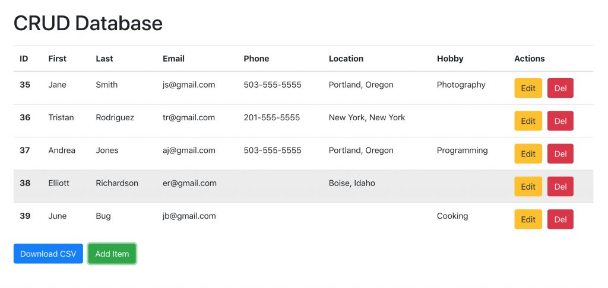

# PROTOCOLO HTTP

## ¿Qué significa HTTP y cuál es su propósito principal?

HTTP significa Protocolo de Transferencia de Hipertexto (Hypertext Transfer Protocol). Su proposito principal es facilitar la comunicacion entre servidores y clientes. Básicamente HTTP permite que los navegadores web soliciten recursos como por ejemplo,páginas web y archivos,servidores web y que los servidores web respondan con esos recursos. Es el protocolo fundamental que permite la navegación y la interacción en la web.

## ¿Cuáles son los principales métodos HTTP?

Los metodos HTTP son acciones estandar que definen la naturaleza de una solicitud que se realiza a un servidor web. Cada metodo tiene un proposito especifico y determina como se debe manejar la solicitud y que tipo de respuesta se espera del servidor. Los principales metodos de HTTP son:

- GET: Se utiliza para solicitar datos del servidor. Es decir obtener informacion como paginas web,imagenes o archivos.

- POST: Se utiliza para enviar datos al servidor para que sean procesados. Es comunmente utilizado en formularios web para enviar informacion que sera procesada y almacenada en el servidor.

- PUT: Actualiza los recursos existente en el servidor. Por ejemplo para modificar un archivo o actualizar la informacion de un usuario.

- DELETE: Se utiliza para eliminar un recurso existente en el servidor. Por ejemplo para borrar un archivo o eliminar un registro de una base de datos.

## ¿Qué es un request en el protocolo HTTP y qué propósito cumple?

Un request en HTTP es simplemente una solicitud que un cliente envía a un servidor para obtener informacion o realizar alguna accion. Es la forma en que interactuamos con los sitios web como por ejemplo al hacer clic en un enlace,enviar un formulario o cargar una pagina o como cuando estamos enviando requests al servidor para obtener lo que necesitamos.

## ¿Qué es un response en el contexto del protocolo HTTP y cuál es su función principal?

Un response en el protocolo HTTP es la respuesta que un servidor envia a un cliente despues de recibir y procesar una solicitud. Su funcion principal es proporcionar al cliente la informacion solicitada o notificar sobre el estado de la solicitud,como si fue exitosa o si ocurrio algún error en la pagina.

## ¿Qué es API y cual es su función?

API significa (Interfaz Programación de Aplicaciones) y su función es permitir que distintos programas o sistemas se comuniquen entre sí de manera estandarizada y segura. Es como un conjunto de reglas y herramientas que facilita la interacción entre diferentes partes de un sistema informático.

## ¿Qué significa el REST en el contexto de las API y cuáles son los principios clave que define?

REST significa Transferencia de Estado Representacional y define un estilo para diseñar sistemas de software. Se basa en principios como el uso de URL para identificar recursos y metodos HTTP estandar (GET,POST,PUT,DELETE) para operaciones CRUD. Esto facilita la comunicación entre clientes y servidores de forma escalable y eficiente.

## ¿Qué es un CRUD? 

CRUD representa las operaciones basicas en sistemas de almacenamiento de datos:Crear (Create),Leer (Read),Actualizar (Update) y Eliminar (Delete)

## ¿Qué es un formato JSON?

JSON significa Notación de Objetos JavaScript (JavaScript Object Notation) es un formato ligero de intercambio de datos. Se utiliza principalmente para transmitir datos entre un servidor y un navegador web como texto plano. Su estructura se asemeja a la de los objetos JavaScript y lo que lo hace facil de leer y escribir para humanos y también facil de analizar y generar para las maquinas.

## ¿Cuáles son los rangos de codigos de estado HTTP y sus significados?

Los codigos de estado HTTP se agrupan en cinco clases y cada una representada por un rango numerico. Aqui tienes los errores de estado HTTP desde el código 100 hasta el 500:

100 - 199: Codigos de estado informativos. No suelen ser considerados como errores.

- 100 Continuar (Continue)
- 101 Cambio de Protocolo (Switching Protocols)
- 102 Procesando (Processing)
- 103 Respuesta Interina (Early Hints)

200 - 299: Códigos de estado de éxito. Indican que la solicitud fue recibida, entendida y aceptada correctamente.

- 200 Correcto (OK)
- 201 Creado (Created)
- 202 Aceptado (Accepted)
- 203 Información no autoritativa (Non-Authoritative Information)
- 204 Sin contenido (No Content)
- 205 Restablecer contenido (Reset Content)
- 206 Contenido parcial (Partial Content)
- 207 Estado múltiple (Multi-Status)
- 208 Ya informado (Already Reported)
- 226 IM Usado (IM Used)

300 - 399: Códigos de estado de redirección. Indican que se debe tomar una acción adicional para completar la solicitud.

- 300 Múltiples opciones (Multiple Choices)
- 301 Movido permanentemente (Moved Permanently)
- 302 Encontrado (Found)
- 303 Ver otro (See Other)
- 304 No modificado (Not Modified)
- 305 Usa Proxy (Use Proxy)
- 306 Cambió temporalmente (Switch Proxy)
- 307 Redirección temporal (Temporary Redirect)
- 308 Redirección permanente (Permanent Redirect)

400 - 499: Códigos de estado de error del cliente. Indican que hay un error en la solicitud del cliente.

- 400 Solicitud incorrecta (Bad Request)
- 401 No autorizado (Unauthorized)
- 402 Pago requerido (Payment Required)
- 403 Prohibido (Forbidden)
- 404 No encontrado (Not Found)
- 405 Método no permitido (Method Not Allowed)
- 406 No aceptable (Not Acceptable)
- 407 Autenticación de proxy requerida (Proxy Authentication Required)
- 408 Tiempo de espera de solicitud (Request Timeout)
- 409 Conflicto (Conflict)
- 410 Desaparecido (Gone)
- 411 Longitud requerida (Length Required)
- 412 Falló la condición previa (Precondition Failed)
- 413 Entidad demasiado grande (Payload Too Large)
- 414 URI demasiado larga (URI Too Long)
- 415 Tipo de medio no soportado (Unsupported Media Type)
- 416 Rango solicitado no satisfactorio (Range Not Satisfiable)
- 417 Falló la expectativa (Expectation Failed)
- 418 Soy una tetera (I'm a teapot)
- 421 Se ha cumplido con la solicitud, pero no hay contenido a devolver (Misdirected Request)
- 422 Entidad no procesable (Unprocessable Entity)
- 423 Bloqueado (Locked)
- 424 Fallo de dependencia (Failed Dependency)
- 425 Colección sin orden (Unordered Collection)
- 426 Mejora necesaria (Upgrade Required)
- 428 Se requiere condicional (Precondition Required)
- 429 Demasiadas solicitudes (Too Many Requests)
- 431 Cabeceras de solicitud de campo de cabecera de longitud (Request Header Fields Too Large)
- 451 No disponible por razones legales (Unavailable For Legal Reasons)

500 - 599: Códigos de estado de error del servidor. Indican que hay un error en el servidor al procesar la solicitud del cliente.

- 500 Error interno del servidor (Internal Server Error)
- 501 No implementado (Not Implemented)
- 502 Puerta de enlace incorrecta (Bad Gateway)
- 503 Servicio no disponible (Service Unavailable)
- 504 Tiempo de espera de la puerta de enlace (Gateway Timeout)
- 505 Versión HTTP no soportada (HTTP Version Not Supported)
- 506 Variante también negocia (Variant Also Negotiates)
- 507 Almacenamiento insuficiente (Insufficient Storage)
- 508 Ciclo detectado (Loop Detected)
- 510 No extendido (Not Extended)
- 511 Requiere autenticación de red (Network Authentication Required)

## Authors

- [@Mauricio Pereda Ruiz](https://github.com/MauriPereda05)

